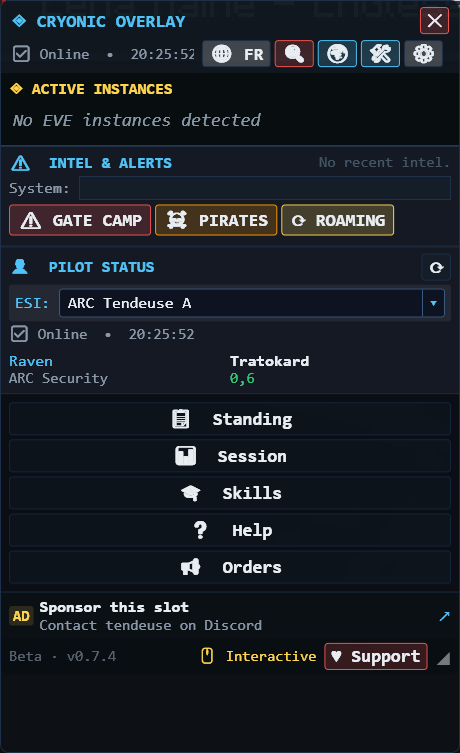

# Cryonic Overlay

A companion window for EVE Online. It sits beside your client and shows your
pilot's standings, skills, session earnings and shared intel — without touching
the game.



**Windows 10/11 · free · open source (Apache-2.0) · English and French**

[**Download the latest release →**](https://github.com/tendeuse/Cryonic-overlay/releases/latest)

---

## What it does

- **Faction standings** — your real standings with every faction and corporation,
  and what they unlock.
- **Skills** — recommended plans per career path, with what you have and what you
  are missing.
- **Session tracking** — ISK and LP earned since you undocked, mining ledger for
  the day, time played.
- **Intel and alerts** — gate camps, hostile roams and pirate reports shared
  between pilots.
- **Multiple clients** — one card per running EVE window, click to switch.
- **Fully translated** — around 250 strings across 18 windows, in French as well
  as English, checked against the live client.

## What it does not do

This matters more than the feature list, so it is deliberately specific:

- **It does not modify, inject into, read the memory of, or automate the EVE
  client.** It is a separate window. Nothing is hooked.
- **It does not type, click, or act in game for you.** No macros, no bots.
- **It does not read your chat logs or your mail.**
- **It has no account credentials.** You log in on CCP's own site; the overlay
  only ever receives a token.
- **It sends nothing anywhere except CCP's ESI API** and, if you opt into intel
  sharing, the intel you choose to report.

## Permissions it asks for, and why

When you link a character you are sent to CCP's login page, which lists the
access being requested. Here is every one and what uses it:

| Scope | Used for |
| --- | --- |
| `esi-characters.read_standings.v1` | The standings panel — the core feature |
| `esi-characters.read_loyalty.v1` | LP balances, and LP earned per session |
| `esi-location.read_location.v1` | Which system you are in, to match intel to it |
| `esi-location.read_ship_type.v1` | The ship shown in the pilot panel |
| `esi-skills.read_skills.v1` | Comparing your skills against the plans |
| `esi-wallet.read_character_wallet.v1` | ISK earned per session |
| `esi-industry.read_character_mining.v1` | The day's mining ledger |

Two things worth knowing about the wallet permission, because its name sounds
much worse than what happens:

- The overlay only ever calls the **balance** endpoint, which returns a single
  number. It never requests your transaction journal or market history. You can
  check: [`EsiClient.cs`](OverlayMVP/Services/EsiClient.cs), `GetWalletBalanceAsync`.
- It is read-only. ESI has no scope that can move your ISK, and this asks for
  nothing that could.

There is no scope here that is not used by a feature you can see. If you find
one, that is a bug — please open an issue.

You can revoke access at any time at
[CCP's third-party authorisations page](https://community.eveonline.com/support/third-party-applications/).

## Install

Download the `.exe` from
[the latest release](https://github.com/tendeuse/Cryonic-overlay/releases/latest)
and run it. One self-contained file — no .NET runtime to install first.

Your settings, linked characters and skins live in a local database, not in the
program file, so they survive upgrades.

### Windows will warn you, and here is the honest reason

The build is **not code-signed**, so SmartScreen shows *"Windows protected your
PC"*. Code-signing certificates cost a few hundred a year, and this project does
not have that money.

You have two ways to check the file is the one that was built:

**Compare the hash.** Every release publishes a SHA-256. Run:

```powershell
Get-FileHash .\CryonicOverlay-v0.7.5-win-x64.exe -Algorithm SHA256
```

**Or read the build log.** Releases are built by GitHub Actions from this public
source — not uploaded from a developer's PC. The run that produced each binary
is public under [Actions](https://github.com/tendeuse/Cryonic-overlay/actions),
so you can see exactly what went in.

You are being asked to run an unsigned binary from someone you do not know. That
is a reasonable thing to be suspicious of. The source is right here — read it, or
build it yourself:

```powershell
git clone https://github.com/tendeuse/Cryonic-overlay.git
cd Cryonic-overlay
dotnet publish OverlayMVP/OverlayMVP.csproj -c Release -r win-x64 --self-contained true -p:PublishSingleFile=true
```

## Hotkeys

| Key | Does |
| --- | --- |
| `Ctrl + Shift + O` | Hide the overlay panel — instance previews stay |
| `Ctrl + Shift + C` | Toggle click-through |
| `Ctrl + Shift + I` | Report roaming gang |
| `Ctrl + Shift + H` | Hide everything |

## Linux and Mac

**There is no Linux or Mac build.** The Windows `.exe` partly works under Proton,
tested on Pop!_OS / Wayland:

| | |
| --- | --- |
| Runs, links a character, all ESI data | ✅ |
| Draws above EVE in **windowed** mode | ✅ |
| Draws above EVE in borderless or fullscreen | ❌ |
| Instance previews, window anchoring | ❌ |
| Hotkeys while the game has focus | ❌ |

Usable with EVE in windowed mode; the rest needs the game's window handle, which
is out of reach while Steam runs EVE in a container. Details in
[docs/proton-test-plan.md](docs/proton-test-plan.md).

## Supporting it

The overlay is free and always will be. Nothing is behind a paywall, and no
feature depends on donating — the sponsor slot and the Support button are
completely separate from what the app does, deliberately, in line with CCP's
rules for third-party tools.

## Reporting a problem

Open an issue with what you were doing, what you expected, what happened, and the
version from the bottom-left corner of the overlay.

## Building

Requires the .NET 8 SDK and Windows.

```powershell
dotnet build OverlayMVP/OverlayMVP.csproj -c Debug
pwsh tools/publish.ps1        # produces dist/CryonicOverlay-v<version>-win-x64.exe
```

Checks before a release:

```powershell
node tools/visual-check.mjs   # every skin against a frozen baseline
node tools/theme-check.mjs verify
node tools/skin-check.mjs
```

## Licence

Apache-2.0. See [LICENSE](LICENSE).

---

*This is a third-party tool and is not affiliated with, endorsed by, or
sponsored by CCP hf. EVE Online and the EVE logo are the registered trademarks
of CCP hf. All rights are reserved worldwide. All artwork, screenshots,
characters, vehicles, storylines, world facts and other recognizable features of
the intellectual property relating to these trademarks are likewise the
intellectual property of CCP hf. CCP hf. has granted permission to Cryonic
Overlay to use EVE Online and all associated logos and designs for promotional
and information purposes on its website but does not endorse, and is not in any
way affiliated with, Cryonic Overlay. CCP is in no way responsible for the
content on or functioning of this program, nor can it be liable for any damage
arising from the use of this program.*
